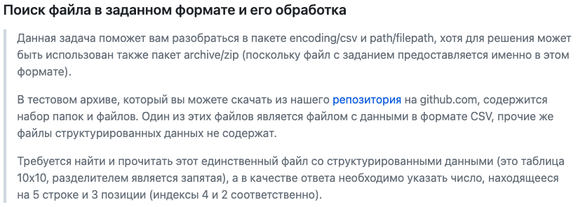
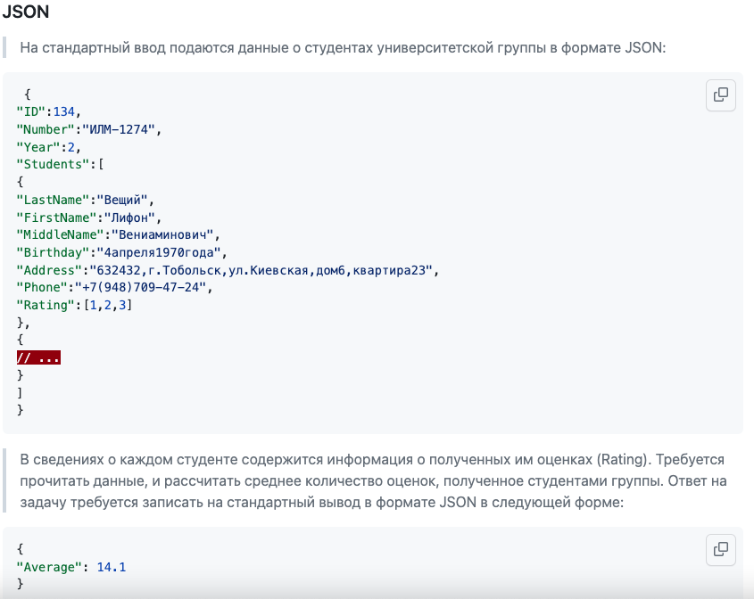
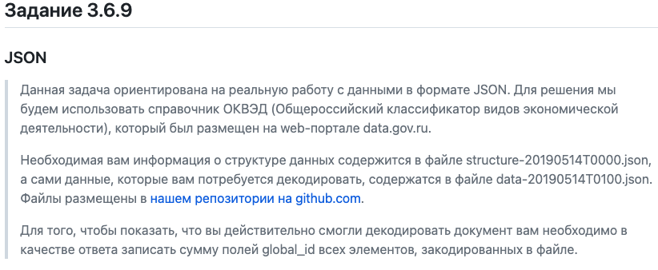
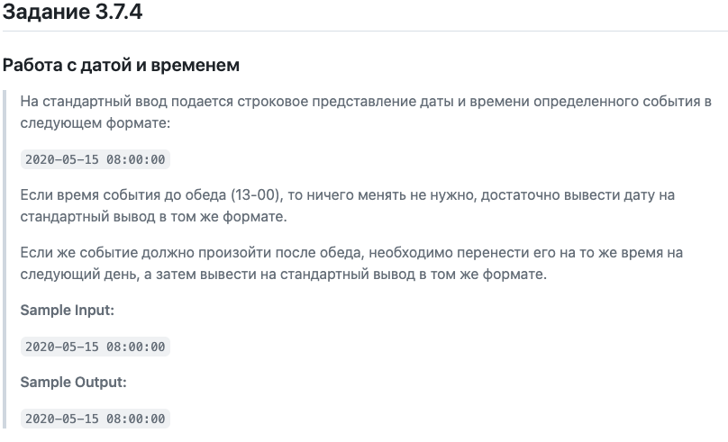

# В данном репозитории собраны некоторые решения из курса [Программирование на Golang](https://stepik.org/course/54403/promo) на платформе Stepik

Проверка решений на Stepik имеет свои особенности и некоторые задания имеют формат "main скрыт, напишите функцию с таким-то названием", поэтому некоторые решения являются только _частью_ кода.

**!** Если вы нашли эту страницу в поисках готовых ответов, то прошу все-таки постараться решить самому и только потом сравнить с моими решениями! **!**

## Задание 3.5.13
### Поиск файла в заданном формате и его обработка
>
> 
>[Ссылка на репозиторий](https://github.com/semyon-dev/stepik-go/tree/master/work_with_files/task_csv_1)

Решение:
```go
package main

import (
	"bufio"
	"fmt"
	"io"
	"os"
)

func main() {
	txt, err := os.Open(".../stepik_3.5.13/taskdata.txt")
	if err != nil {
		fmt.Println(err)
		return
	}
	defer txt.Close()

	reader := bufio.NewReader(txt)
	var count int = 0
	for {
		num_0, err := reader.ReadString(59)
		if err != nil {
			if err == io.EOF {
				break
			} else {
				fmt.Println(err)
				return
			}
		}
		count++
		if len(num_0) == 2 {
			fmt.Println("Строка:", num_0, " Позиция:", count)
		}
	}
} 
```
## Задание 3.6.6
### JSON
>

Решение:
```go
package main

import (
	"encoding/json"
	"fmt"
	"os"
)

type Group struct {
	ID       string
	Number   string
	Year     int
	Students []Student
}

type Student struct {
	LastName   string
	FirstName  string
	MiddleName string
	Birthday   string
	Address    string
	Phone      string
	Rating     []float32
}

type Rating struct {
	Average float32
}

func main() {

	var GroupGoStruct Group
	json.NewDecoder(os.Stdin).Decode(&GroupGoStruct)

	var countStudents float32
	var countMarks float32
	for _, v := range GroupGoStruct.Students {
		countStudents++
		for _, _ = range v.Rating {
			countMarks++
		}
	}
	var answer Rating
	answer.Average = countMarks / countStudents
	data, err := json.MarshalIndent(answer, "", "    ")
	if err != nil {
		fmt.Println(err)
	}
	fmt.Print(string(data))
}
```
## Задание 3.6.9
### JSON
>
>[Ссылка на репозиторий](https://github.com/semyon-dev/stepik-go/tree/master/work_with_json).

Решение:
```go
package main

import (
	"encoding/json"
	"fmt"
	"net/http"
)

type Global_ids struct {
	Id int `json:"global_id"`
}

func main() {
	inURL := "https://github.com/semyon-dev/stepik-go/raw/master/work_with_json/data-20190514T0100.json"
	data, _ := http.Get(inURL)
	var base []Global_ids

	json.NewDecoder(data.Body).Decode(&base)

	var count int

	for _, v := range base {
		count += v.Id
	}
	fmt.Println(count)
}
```
## Задание 3.7.4
### Работа с датой и временем
>

Решение:
```go
package main

import (
"bufio"
"os"
"fmt"
"time"
)

func main() {
layot := "2006-01-02 15:04:05"

	scanner := bufio.NewScanner(os.Stdin)
	scanner.Scan()
	input := scanner.Text()
    
	inTime, err := time.Parse(layot, input)
	if err != nil {
		panic(err)
	}
	
	if inTime.Hour()<13 {
        fmt.Println(string(inTime.Format(layot)))
    } else {
		inTime=inTime.Add(time.Hour*24)
        fmt.Println(string(inTime.Format(layot)))
	}
}
```
